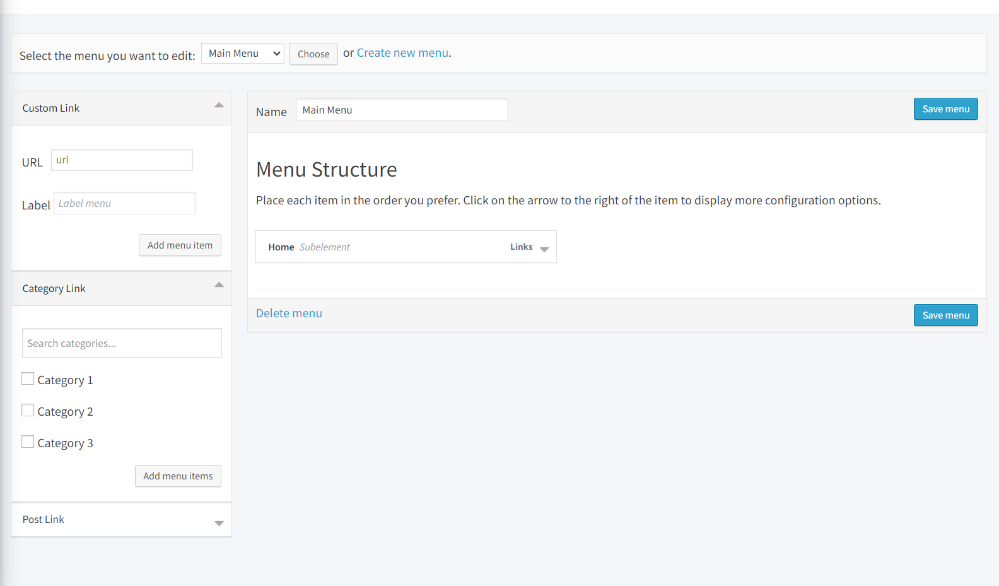
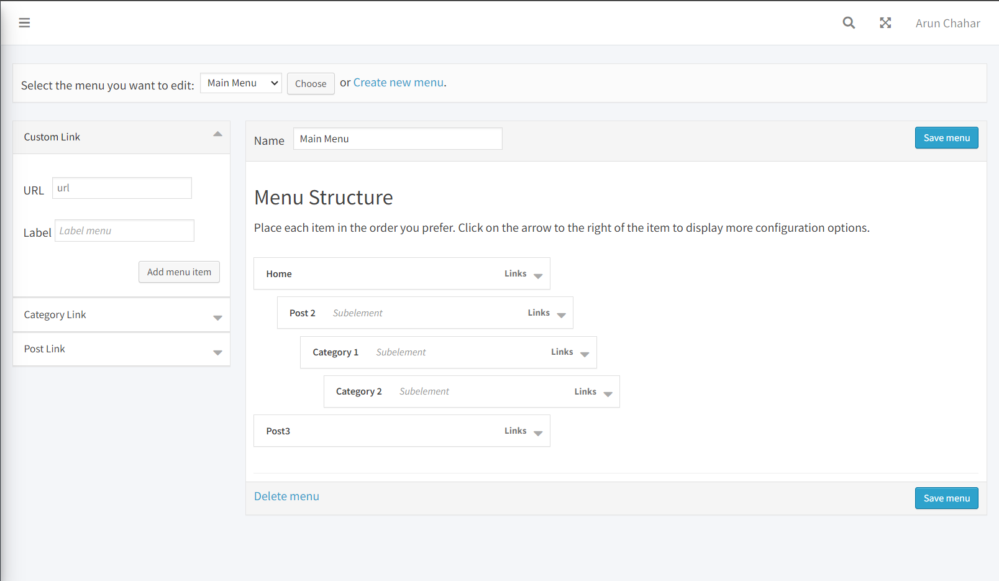

# laravel-menu
Laravel dyanmic menu like wordPress
# Laravel Drag and drop dynamic menu like wordPress




# Installation

1. Run
```php
composer require vfixtechnology/laravel-menu:dev-master
```

**Step 2 & 3 are optional if you are using laravel 9 or 10**

2. Add the following class, to "providers" array in the file config/app.php (optional on laravel 9)

```php
Vfixtechnology\Menu\MenuServiceProvider::class,
```

3. add facade in the file config/app.php (optional on laravel 9)

```php
'Menu' => Vfixtechnology\Menu\Facades\Menu::class,
```

4. Run publish

```php
php artisan vendor:publish --provider="Vfixtechnology\Menu\MenuServiceProvider"
```

5. Configure (optional) in **_config/menu.php_** :

- **_CUSTOM MIDDLEWARE:_** You can add you own middleware
- **_TABLE PREFIX:_** By default this package will create 2 new tables named "menus" and "menu_items" but you can still add your own table prefix avoiding conflict with existing table
- **_TABLE NAMES_** If you want use specific name of tables you have to modify that and the migrations
- **_Custom routes_** If you want to edit the route path you can edit the field
- **_Role Access_** If you want to enable roles (permissions) on menu items

6. Run migrate

```php
php artisan migrate
```

DONE

### Menu Builder Usage Example - displays the builder

On your view blade file

```php
@extends('app')

@section('content')
    {!! Menu::render() !!}
@endsection

//YOU MUST HAVE JQUERY LOADED BEFORE menu scripts
@push('scripts')
    {!! Menu::scripts() !!}
@endpush
```

### Using The Model

Call the model class

```php
use Vfixtechnology\Menu\Models\Menus;
use Vfixtechnology\Menu\Models\MenuItems;

```

### Menu Usage Example (a)

A basic two-level menu can be displayed in your blade template

##### Using Model Class
```php

/* get menu by id*/
$menu = Menus::find(1);
/* or by name */
$menu = Menus::where('name','Test Menu')->first();

/* or get menu by name and the items with EAGER LOADING (RECOMENDED for better performance and less query call)*/
$menu = Menus::where('name','Test Menu')->with('items')->first();
/*or by id */
$menu = Menus::where('id', 1)->with('items')->first();

//you can access by model result
$public_menu = $menu->items;

//or you can convert it to array
$public_menu = $menu->items->toArray();

```

##### or Using helper
```php
// Using Helper 
$public_menu = Menu::getByName('Public'); //return array

```

### Menu Usage Example (b)

Now inside your blade template file place the menu using this simple example

```php
<div class="nav-wrap">
    <div class="btn-menu">
        <span></span>
    </div><!-- //mobile menu button -->
    <nav id="mainnav" class="mainnav">

        @if($public_menu)
        <ul class="menu">
            @foreach($public_menu as $menu)
            <li class="">
                <a href="{{ $menu['link'] }}" title="">{{ $menu['label'] }}</a>
                @if( $menu['child'] )
                <ul class="sub-menu">
                    @foreach( $menu['child'] as $child )
                        <li class=""><a href="{{ $child['link'] }}" title="">{{ $child['label'] }}</a></li>
                    @endforeach
                </ul><!-- /.sub-menu -->
                @endif
            </li>
            @endforeach
        @endif

        </ul><!-- /.menu -->
    </nav><!-- /#mainnav -->
 </div><!-- /.nav-wrap -->
```

### HELPERS

### Get Menu Items By Menu ID

```php
use Vfixtechnology\Menu\Facades\Menu;
...
/*
Parameter: Menu ID
Return: Array
*/
$menuList = Menu::get(1);
```

### Get Menu Items By Menu Name

In this example, you must have a menu named _Admin_

```php
use Vfixtechnology\Menu\Facades\Menu;
...
/*
Parameter: Menu ID
Return: Array
*/
$menuList = Menu::getByName('Admin');
```

### Want to add the extra features like category and posts follow steps:


Step 1: Open the MenuController path vendor/vfixtechnology/laravel-menu/src/Controllers/MenuController
```php
    public function addCategory(Request $request)
    {
        $categories = $request->input('categories');

        foreach ($categories as $categoryData) {
            if ($categoryData['url']) {
                $menuItem = new MenuItems();
                if (config('menu.use_roles')) {
                    $menuItem->role_id = $request->input("rolemenu") ? $request->input("rolemenu") : 0;
                }
                $menuItem->menu = $request->input("idmenu");
                $menuItem->sort = MenuItems::getNextSortRoot($request->input("idmenu"));
                $menuItem->label = $categoryData['name'];
                $menuItem->link = $categoryData['url'];
                $menuItem->save();
            }
        }

        return response()->json(['message' => 'Categories added successfully']);
    }
```
This logic is to add categories in the menu

Step 2: Pass data to blade and create form in resources/view/vendor/wmenu/menu-html.blade.php 

```php
    @php
        $categories = [
            ['id' => 1, 'name' => 'Category 1', 'slug' => 'category-1'],
            ['id' => 2, 'name' => 'Category 2', 'slug' => 'category-2'],
            ['id' => 3, 'name' => 'Category 3', 'slug' => 'category-3'],
            // Add more categories as needed
        ];
    @endphp


    <form id="nav-menu-meta" action=""
        class="nav-menu-meta" method="post">
        @csrf
        <div id="side-sortables" class="accordion-container">
            <ul class="outer-border">
                <li class="control-section accordion-section open add-page"
                    id="add-page">
                    <h3 class="accordion-section-title hndle" tabindex="0">
                        Category Link <span class="screen-reader-text">Press return
                            or enter to expand</span></h3>

                    <div class="accordion-section-content ">
                        <div class="inside">
                            <input type="search" class="form-control" id="category-search" placeholder="Search categories...">

                            <div class="customlinkdiv" id="customlinkdiv">
                                @foreach ($categories as $category)

                                    <p id="menu-item-url-wrap{{ $category['id'] }}" class="category-item">


                                            <input
                                                id="category-slug{{ $category['id'] }}"
                                                value="{{ $category['slug'] }}"
                                                name="categories[{{ $category['id'] }}][url]"
                                                type="hidden"
                                                class="menu-item-textbox"
                                                placeholder="url" disabled>

                                    </p>
                                    <p id="menu-item-url-wrap{{ $category['id'] }}" class="category-item">
                                        <label class="custom-checkbox-label"
                                        for="category-checkbox{{ $category['id'] }}">
                                        <input
                                            id="category-checkbox{{ $category['id'] }}"
                                            name="categories[{{ $category['id'] }}][selected]"
                                            value="1" type="checkbox"
                                            class="category-checkbox">
                                        <span class=""></span>
                                        {{ $category['name'] }}
                                    </label>
                                    <label
                                        id="category-label{{ $category['id'] }}"
                                        style="display: none;">{{ $category['name'] }}</label>
                                    </p>
                                @endforeach

                                @if (!empty($roles))
                                    <p id="menu-item-role_id-wrap">
                                        <label class="howto"
                                            for="category-menu-item-name">
                                            <span>Role</span>&nbsp;
                                            <select id="category-menu-item-role"
                                                name="role">
                                                <option value="0">Select Role
                                                </option>
                                                @foreach ($roles as $role)
                                                    <option
                                                        value="{{ $role->$role_pk }}">
                                                        {{ ucfirst($role->$role_title_field) }}
                                                    </option>
                                                @endforeach
                                            </select>
                                        </label>
                                    </p>
                                @endif
                                <p class="button-controls">
                                    <button type="button"
                                        onclick="addCategories()"
                                        class="button-secondary submit-add-to-menu right">Add
                                        menu items</button>
                                </p>
                                <span class="spinner" id="spincategory"></span>
                            </div>
                        </div>
                    </div>
                </li>
            </ul>
        </div>
    </form>
```
Here I have used the static category list you can get it dynamically by using the controller too

Step 3: Now Create the js code to send the AJAX Request in resources/views/vendor/wmenu/menu-html.blade.php (in footer)

```javascript

    <script>
        function addCategories() {
        $('#spincategory').show();

        var categoriesData = [];

        $('[id^=category-slug]').each(function() {
            var categoryId = $(this).attr('id').replace('category-slug', '');

            if ($('#category-checkbox' + categoryId).is(':checked')) {
                var categoryData = {
                    url: $(this).val(),
                    name: $('#category-label' + categoryId).text()
                };
                categoriesData.push(categoryData);
            }
        });

        $.ajax({
            data: {
                categories: categoriesData,
                rolemenu: $('#category-menu-item-role').val(),
                idmenu: $('#idmenu').val()
            },
            url: '{{ route('addCategory') }}',
            type: 'POST',
            success: function(response) {
                console.log('Categories added successfully');
                window.location.reload();
            },
            error: function(xhr, textStatus, errorThrown) {
                console.log('AJAX Error:', errorThrown);
               // console.log('Response:', xhr.responseText);
            },
            complete: function() {
                $('#spincategory').hide();
            }
        });

        // console.log('AJAX Request Payload:', {
        //     categories: categoriesData
        // });
    }
    </script>
```

Step 4: Create the route to send the request
Add this route code in the route.php file vendor/vfixtechnology/laravel-menu/routes.php
```php
Route::post($path . '/addCategoryToMenu',array('as' => 'addCategory', 'uses' => '\vfixtechnology\Menu\Controllers\MenuController@addCategory'));
```


Step 5: Now add below code to activate the live search using jquery in resources/views/vendor/wmenu/menu-html.blade.php

Add jquery via CDN or local file
```javascript
<script src="https://code.jquery.com/jquery-3.7.1.slim.min.js" integrity="sha256-kmHvs0B+OpCW5GVHUNjv9rOmY0IvSIRcf7zGUDTDQM8=" crossorigin="anonymous"></script>
```
Then add the below jQuery code to add the live search
```javascript
    <script>
        $(document).ready(function() {
            $('#category-search').on('input', function() {
                var searchText = $(this).val().toLowerCase();
    
                $('.category-item').each(function() {
                    var categoryText = $(this).text().toLowerCase();
                    if (categoryText.includes(searchText)) {
                        $(this).show();
                    } else {
                        $(this).hide();
                    }
                });
            });
        });
    </script>
```

### Follow the similar step for to add posts, pages or anything. 

### Compatibility

- Tested with laravel 8.x, 9.x, 10.x
